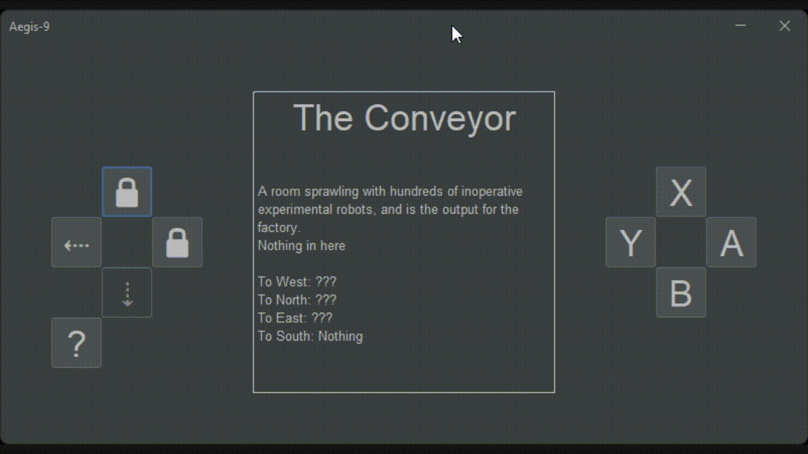
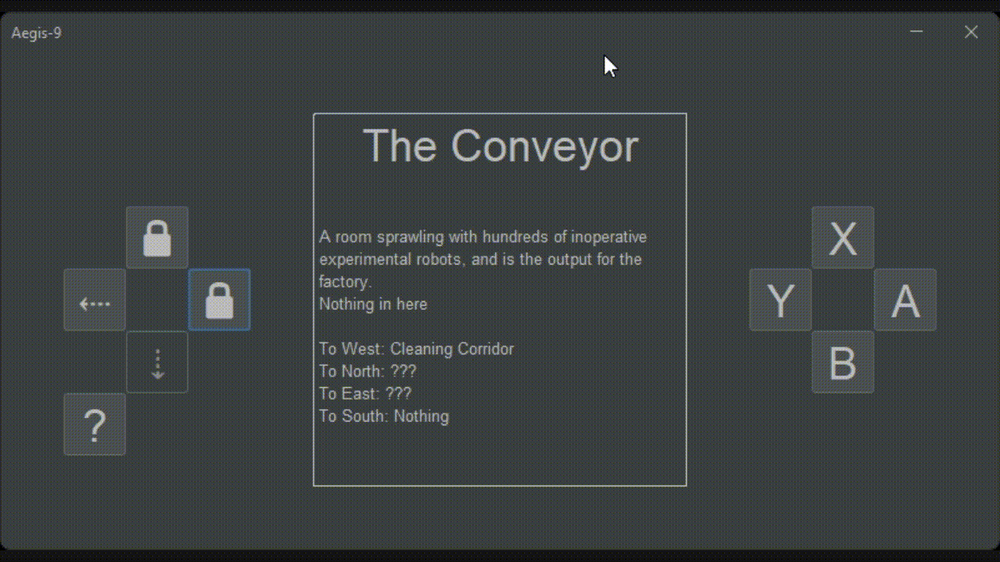
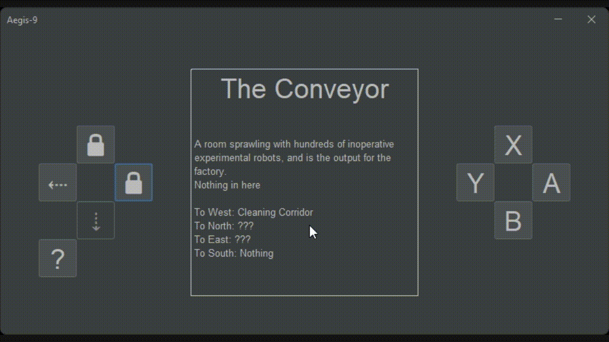
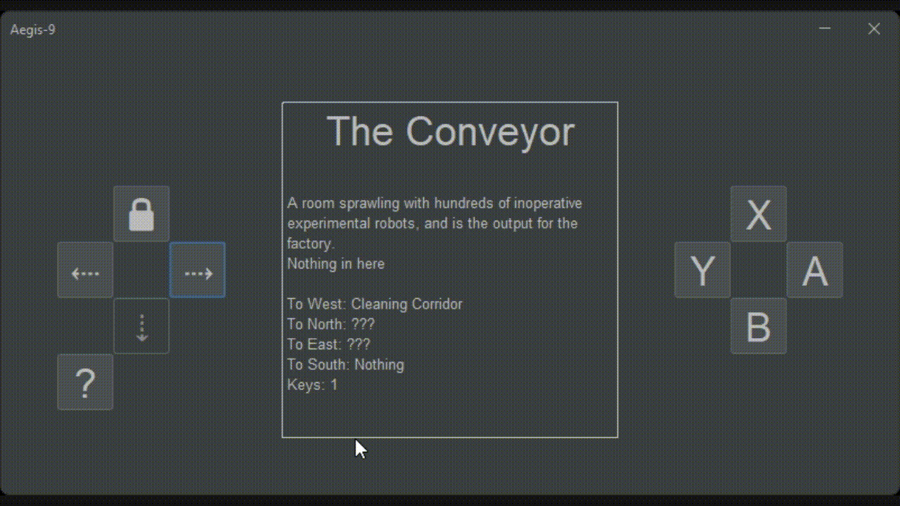
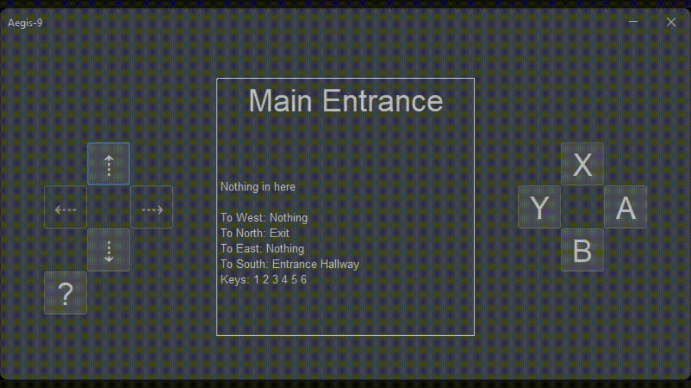

# Results of Testing

The test results show the actual outcome of the testing, following the [Test Plan](test-plan.md)

---

## Travelling to a room.

Using the GUI the user should be able to travel to a different room.

### Test Data To Use

Starting from room 0 ("The Conveyor") pressing the west button. This is a valid input.

### Test Result

This functions as expected and lets the user travel between various locations

---

## Travelling to a room which doesn't exist.

The user should not be able to travel outside the map.

### Test Data To Use

Starting from room 0 ("The Conveyor") pressing the south button. This is an invalid input as there is no location to the south of room 0 ("The Conveyor")

### Test Result

Because the button becomes disabled, the user will never encounter a situation where they travel to a non-existing location.

---

## Travelling to a locked room. (No key)

Using the GUI the user may encounter locked rooms which require keys.

### Test Data To Use

Starting from room 0 ("The Conveyor") pressing the east button. Without a key this is an invalid input.

### Test Result

The user cannot enter a room they do not have the key for. This is working as intended.

---

## Travelling to a locked room. (With key)

Using the GUI the user may encounter locked rooms which require keys.

### Test Data To Use

Starting in room 0 ("The Conveyor") pressing the east button. With key 1 this is a valid input.

### Test Result

When a user collects a key, all rooms that use that key will automatically unlock and allow the user to travel there. This is working as intended.

---

## Travelling to the exit

using the GUI the user can travel to the exit and win the game.

### Test Data To Use

Starting at room 23 (Main Entrance) pressing the North button. With key 6 this is a valid input.

### Test Result

this is working as intended, Keep in mind that the ending popup doesn't show up in the screen recording

---

## Travelling to all locations

The User can travel to every location if they have all the keys

### Test Data To Use

Starting from room 0 (The Conveyor) with keys 1, 2, 3, 4, 5, and 6, and traveling to each location. this is a boundary

### Test Result

this is working as intended, Keep in mind that the ending popup doesn't show up in the screen recording

---
